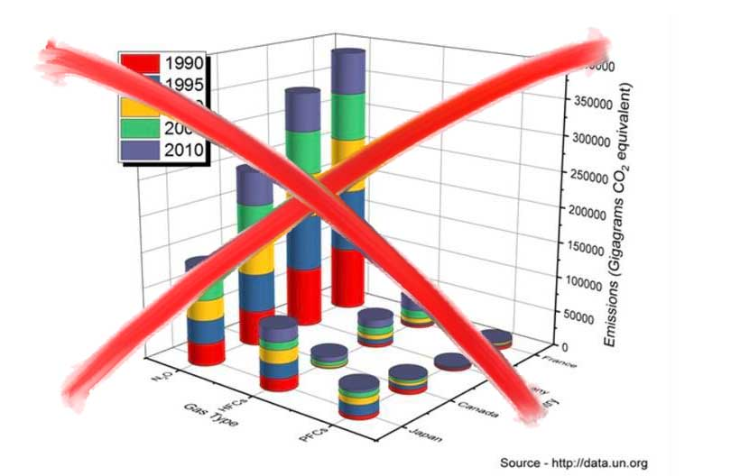

```{r setup, echo=FALSE, message=FALSE, warning=FALSE}
source("setup.R")$value
library(xaringanExtra)
library(tidyverse)
library(here)
library(magrittr)
library(knitr)
library(ggplot2)
library(ggExtra)
library(ggtext)
library(grid)
library(gridExtra)
library(reshape2)
library(datasauRus)
library(emo)
```

class: inverse, center, middle

# Why is data visualization important?

---

# Data visualization: An integral part of the Analysis

```{r data, include=FALSE}
A <- datasaurus_dozen %>% filter(dataset == "star") %>% mutate(Set = "A")
B <- datasaurus_dozen %>% filter(dataset == "dino") %>% mutate(Set = "B")
C <- datasaurus_dozen %>% filter(dataset == "away") %>% mutate(Set = "C")

bat_bdays <- read_csv("bat_bdates.csv")

bone_tumors <- read_delim("bone_tumors_dahlin_1978.csv", delim = ";", locale = locale(decimal_mark = ".")) %>% 
  mutate(
    tumor_fct = as.factor(tumor),
    tumor_fct = forcats::fct_relevel(tumor_fct, "Chondrosarcoma", "Osteosarcoma", "Ewing Sarcoma", "Fibrosarcoma", "Osteochondroma", "Chondroma", "Osteoid osteoma", "Giant cell tumor")
    )
# Digitized from Freyschmidt (2010) with https://apps.automeris.io/wpd/

genderIR <- read_csv("ir2018_industry_payments.csv")
```

- Let A and B = two datasets ("study populations")

- Both have datapoints of *x* (e.g. patient age) and *y* (e.g. Serum Alkaline Phosphatase)

- The properties of the datasets are as follows:


```{r, echo=FALSE, results='asis'}
tab <- bind_rows(A, B) %>% 
  group_by(Set) %>% 
  summarize(
    `Mean X` = mean(x),
    `Mean Y` = mean(y),
    `Std. Dev. X` = sd(x),
    `Std. Dev. Y` = sd(y),
    `Pearson corr. x|y` = cor(x, y),
    .groups = "keep"
  )
tab %>% knitr::kable(format='html')
```


- Are age and alkaline phosphatase the same in both populations A and B?

---

# Data visualization: An integral part of the Analysis

- Are those two the same?

```{r, echo=FALSE, results='asis'}
tab <- bind_rows(A, B) %>% 
  group_by(Set) %>% 
  summarize(
    `Mean X` = mean(x),
    `Mean Y` = mean(y),
    `Std. Dev. X` = sd(x),
    `Std. Dev. Y` = sd(y),
    `Pearson corr. x|y` = cor(x, y),
    .groups = "keep"
  )
tab %>% knitr::kable(format='html')
```


```{r, echo=FALSE, fig.height = 5, fig.width = 10, fig.align='center'}
bind_rows(A, B) %>% 
  ggplot(data = ., aes(x, y)) +
  geom_point() +
  facet_wrap(~Set)
```
---

# Data visualization: An integral part of the Analysis

- What about C?

```{r, echo=FALSE, results='asis'}
tabc <- bind_rows(A, B, C) %>% 
  group_by(Set) %>% 
  summarize(
    `Mean X` = mean(x),
    `Mean Y` = mean(y),
    `Std. Dev. X` = sd(x),
    `Std. Dev. Y` = sd(y),
    `Pearson corr. x|y` = cor(x, y),
    .groups = "keep"
  )
tabc %>% knitr::kable(format='html')
```

--

```{r, echo=FALSE, fig.height = 3.5, fig.width = 10, fig.align='center'}
bind_rows(A, B, C) %>% 
  ggplot(aes(x, y)) +
  geom_point() +
  facet_wrap(~Set)
```

---

# Data visualization: Tell the story of your research

.pull-left[

```{r, echo = FALSE, message=FALSE, fig.width=8, fig.height=5}
ggplot(bat_bdays, aes(x=dayofyear, fill=BATbin %>% chartr('10', 'yn', .) %>% as.factor())) +
  geom_density(alpha=.7, kernel='rectangular') + 
  labs(x="Day of the Year") +
  guides(fill = guide_legend("BAT")) +
  scale_fill_manual(values=c('#007CBA','#8FC7E8')) +
  #ggtitle('Birthday Distribution in Human Population') +
  coord_cartesian(xlim=c(0, 365), ylim=c(8e-04, 105e-05)) +
  scale_x_continuous(expand=c(0,0)) +
  theme_classic() +
  theme(axis.line.x = element_line(color="black"),
        axis.line.y = element_line(color="black"))
```
  .footnote[
  Source: Sun et al., Cold-induced epigenetic programming of the sperm enhances brown adipose tissue activity in the offspring, [**Nature Medicine** volume 24, pages1372–1383(2018)](https://www.nature.com/articles/s41591-018-0102-y)
  ]
]

--

.pull-right[
```{r, echo = FALSE, message=FALSE, fig.width=6.5, fig.height=4.6}
bat_dens <- function(df, BAT_bin) {
  df %>% 
    filter(BATbin==BAT_bin) %>% 
    pull(dayofyear) %>% 
    density(from=0, to=365, kernel='rectangular') %>% 
    .[c('x','y')] %>% 
    data.frame()
}

dens0 <- bat_dens(bat_bdays, 0)
dens1 <- bat_dens(bat_bdays, 1)
dens_diff <- cbind(dens0['x'], y=(dens1$y - dens0$y))

ggplot(data=dens_diff, aes(x=x, y=y)) + 
  geom_line() + 
  geom_hline(aes(yintercept=0), lty=2) +
  xlab('Day of the Year') + ylab('Deviation from Estimated Birthday Distribution') +
  theme_classic() + theme(legend.position="none", 
                          axis.line.x = element_line(),
                          axis.line.y = element_line()) +
  scale_x_continuous(expand = c(0, 0)) -> fig_dens

fig_dens
```
]
--
.pull-right[
```{r, echo = FALSE, message=FALSE, fig.width=6.5, fig.height=1, fig.align='center'}
ggplot() +
  geom_rect(aes(xmin=0, xmax=30, ymin=2, ymax=5), colour='black', fill='white') +
  annotate("text", x=15, y=4, label = "Apr") +
  geom_rect(aes(xmin=31, xmax=59, ymin=2, ymax=5), colour='black', fill='black') +
  annotate("text", x=45, y=4, label = "May", colour = "white") +
  geom_rect(aes(xmin=60, xmax=90, ymin=2, ymax=5), colour='black', fill='white') +
  annotate("text", x=75, y=4, label = "Jun") +
  geom_rect(aes(xmin=91, xmax=120, ymin=2, ymax=5), colour='black', fill='black') +
  annotate("text", x=105, y=4, label = "Jul", colour = "white") +
  geom_rect(aes(xmin=121, xmax=151, ymin=2, ymax=5), colour='black', fill='white') +
  annotate("text", x=135, y=4, label = "Aug") +
  geom_rect(aes(xmin=152, xmax=181, ymin=2, ymax=5), colour='black', fill='black') +
  annotate("text", x=165, y=4, label = "Sep", colour = "white") +
  geom_rect(aes(xmin=182, xmax=212, ymin=2, ymax=5), colour='black', fill='white') +
  annotate("text", x=196, y=4, label = "Oct") +
  geom_rect(aes(xmin=213, xmax=242, ymin=2, ymax=5), colour='black', fill='black') +
  annotate("text", x=226, y=4, label = "Nov", colour = "white") +
  geom_rect(aes(xmin=243, xmax=273, ymin=2, ymax=5), colour='black', fill='white') +
  annotate("text", x=257, y=4, label = "Dec") +
  geom_rect(aes(xmin=274, xmax=303, ymin=2, ymax=5), colour='black', fill='black') +
  annotate("text", x=288, y=4, label = "Jan", colour = "white") +
  geom_rect(aes(xmin=304, xmax=334, ymin=2, ymax=5), colour='black', fill='white') +
  annotate("text", x=318, y=4, label = "Feb") +
  geom_rect(aes(xmin=335, xmax=364, ymin=2, ymax=5), colour='black', fill='black') +
  annotate("text", x=345, y=4, label = "Mar", colour = "white") +
  theme_classic() +
  theme(axis.ticks.y = element_blank(), axis.text.y = element_blank(), 
        axis.title = element_blank(), axis.line.y = element_blank(),
        plot.title = element_text(hjust = 0.5)) +
  ggtitle('Projected Month of Conception') -> fig_year_bar

fig_year_bar
```
]

---

# Data visualization: Tell the story of your research

.pull-left[
```{r, echo = FALSE, message=FALSE, fig.width=6.5, fig.height=4.6}
fig_dens
```
```{r, echo = FALSE, message=FALSE, fig.width=6.5, fig.height=1, fig.align='center'}
fig_year_bar
```
]
.pull-right[
```{r, echo = FALSE, message=FALSE, warning=FALSE, fig.width=6.5, fig.height=4.65, fig.align='right'}
temp_monthly <- read_csv("swiss_temp_monthly.csv") 
m_order <- c(colnames(temp_monthly[c(5:13,2:4)]))
temp_monthly %<>% reshape2::melt(id.vars='year', variable.name='month') %>% 
  mutate(Month = factor(month, levels=m_order, labels=month.name[c(4:12,1:3)]))

ggplot(data=temp_monthly, aes(y=value, x=Month)) +
  geom_bar(stat = "summary", fun.y = "mean", aes(fill=..y..)) +
  scale_fill_gradient2(low="blue", high="red", midpoint=10) +
  labs(y='Temperature [°C]') +
  scale_x_discrete(labels = abbreviate) +
  theme_classic() +
  theme(legend.position = "none") +
  labs(x = "Projected Month of Conception") -> fig_temp
fig_temp
```
]
.footnote[
`r paste0(rep("<br />", 58), collapse = "")`
  Source: Sun et al., Cold-induced epigenetic programming of the sperm enhances brown adipose tissue activity in the offspring, [**Nature Medicine** volume 24, pages1372–1383(2018)](https://www.nature.com/articles/s41591-018-0102-y)
]
---

# Why Data Visualization?

## `r emo::ji("star")` Important data analysis and exploration tool

- Tells you properties about your data that may be hidden by standard summary metrics

## `r emo::ji("star")` Tell the story of your research

- When writing a paper: Start with the figures, then write the text around the figures

---

background-image: url("img/delaunay_circulaires.png")
background-size: cover
class: center, bottom, inverse

## Different Plot Types

#### Robert Delaunay; Formes circulaires, Soleil et Lune (1912/1931)
##### Kunsthaus Zürich

---

# Overview: Plot Types

![:col_row Histogram, Scatter plot, Boxplot, Line chart]
![:col_list One numeric, Two Numeric, Numeric/Categorical, Numeric/Ordinal]

```{r, echo=FALSE, message=FALSE, fig.width=3, fig.height=2.5}
qplot(x = C$x, geom = "histogram") +
  theme_minimal()
```
&nbsp;&nbsp;&nbsp;
```{r, echo=FALSE, message=FALSE, fig.width=3, fig.height=2.5}
qplot(x = C$x, y = C$y, geom = "point") +
  theme_minimal()
```
&nbsp;&nbsp;&nbsp;
```{r, echo=FALSE, message=FALSE, fig.width=3, fig.height=2.5}
bind_rows(A, B, C) %>% mutate(Set = as.factor(Set)) %>% 
qplot(x = Set, y = x, geom = "boxplot", data = .) +
  theme_minimal()
```
&nbsp;&nbsp;&nbsp;
```{r, echo=FALSE, message=FALSE, fig.width=3, fig.height=2.5}
bone_tumors %>% filter(tumor == "Osteosarcoma") %>% 
qplot(x = decade, y = percent, geom = "line", data = .) +
  theme_minimal()
```
--

![:col_row Density plot, Scatter with marginal plot, Violin plot, Area plots]

```{r, echo=FALSE, message=FALSE, fig.width=3, fig.height=2.5}
qplot(x = C$x, geom = "density") +
  theme_minimal()
```
&nbsp;&nbsp;&nbsp;
```{r, echo=FALSE, message=FALSE, fig.width=3, fig.height=2.5}
qplot(x = C$x, y = C$y, geom = "point") +
  theme_minimal() -> fig_marginal

ggExtra::ggMarginal(fig_marginal, type="histogram")
```
&nbsp;&nbsp;&nbsp;
```{r, echo=FALSE, message=FALSE, fig.width=3, fig.height=2.5}
bind_rows(A, B, C) %>% mutate(Set = as.factor(Set)) %>% 
qplot(x = Set, y = x, geom = "violin", data = .) +
  theme_minimal()
```
&nbsp;&nbsp;&nbsp;
```{r, echo=FALSE, message=FALSE, fig.width=4, fig.height=2.5}
qplot(x = decade, y = percent, fill = tumor, geom = "area", data = filter(bone_tumors, dign=="malignant")) +
  theme_minimal() +
  scale_fill_brewer()
```

---

# Overview: Plot Types

<iframe src="https://www.data-to-viz.com/#explore" width="100%" height="500px" frameBorder="0"></iframe>

.footnote[
Interactive graph on [data-to-viz.com](https://www.data-to-viz.com/)
]

---
background-image: url(img/map_engelberg.png)
background-size: cover
class: inverse, bottom, center

<h2 style="color: black; text-shadow: 2px 2px 8px #FFFFFF;">Colors and other elements</h2>

---

class: animated, fadeIn

# Color

.pa4.z-0[
.ml0.mt0.pl4.black-90.bl.bw2.b--blue[
.f3.f4-m.f3-l.lh-copy.measure.mt0[
To paint well is simple: Put the right color at the right place
]
.center.f6.ttu.tracked.fs-normal[
Paul Klee
]]]

- Label: Color is a .leader-end-1[noun]

- Measure: Color is a .leader-end-2[dimension]

- Represent reality: Color is a .leader-end-3[representation]

- Decorate: Color is an .leader-end-4[accessory]


--

.leader-start-1.right[

]
---

class: animated, fadeIn

# Color

.pa4.z-0[
.ml0.mt0.pl4.black-90.bl.bw2.b--blue[
.f3.f4-m.f3-l.lh-copy.measure.mt0[
To paint well is simple: Put the right color at the right place
]
.center.f6.ttu.tracked.fs-normal[
Paul Klee
]]]

- Label: Color is a .leader-end-1[noun]

- Measure: Color is a .leader-end-2[dimension]

- Represent reality: Color is a .leader-end-3[representation]

- Decorate: Color is an .leader-end-4[accessory]

.leader-start-2.right[
```{r, echo=FALSE, fig.width=4, fig.height=4} 
fig_temp +
  theme_void() +
  theme(legend.position = "none")
```
]

--

.leader-start-4[&nbsp;]

---

class: animated, fadeIn

# Color

.pa4.z-0[
.ml0.mt0.pl4.black-90.bl.bw2.b--blue[
.f3.f4-m.f3-l.lh-copy.measure.mt0[
To paint well is simple: Put the right color at the right place
]
.center.f6.ttu.tracked.fs-normal[
Paul Klee
]]]

- Label: Color is a .leader-end-1[noun]

- Measure: Color is a .leader-end-2[dimension]

- Represent reality: Color is a .leader-end-3[representation]

- Decorate: Color is an .leader-end-4[accessory]

.leader-start-3.right[

]

---
class: animated fadeIn

# Case Study: Color

.center[


Figure 5 from Katz SC et al., Operative Blood Loss <br />
Independently Predicts Recurrence and Survival After Resection <br />of Hepatocellular Carcinoma, Ann Surg 2009;249: 617–623

]
---
class: animated fadeIn

# Case Study: Color

.center[

```{r, echo=FALSE, fig.width=8, fig.height=6}
# Estimate data from Figure in the absence of raw data
bloodloss_fig_estimate <- data.frame(
  n = c(80, 42, 25, 14, 31),
  bl_est = factor(x = 1:5, labels = c("<500 ml", "501 - 1000 ml", "1001-1500 ml", "1501 - 2000 ml", ">2000 ml"), ordered = TRUE),
  bl_point = c(250, 750, 1250, 1750, 2250),
  mean_surv = c(82, 72, 37, 30, 19)
)

first_bl <- ggplot(data = bloodloss_fig_estimate, aes(x = bl_est, y = mean_surv)) +
  geom_bar(stat = "identity", fill = "black") +
  theme_minimal() +
  labs(y = "Months", x = "EBL")

first_bl
```


modified after Katz SC et al., Ann Surg 2009;249: 617–623

]

---
class: animated rollIn

# Case Study: Color

.center[

```{r, echo=FALSE, fig.width=8, fig.height=6}

ggplot(data = bloodloss_fig_estimate, aes(x = mean_surv, y = bl_est)) +
  geom_bar(stat = "identity", fill = "black") +
  theme_minimal() +
  labs(x = "Months", y = "EBL")
  
```

modified after Katz SC et al., Ann Surg 2009;249: 617–623

]
---
class: animated rollIn

# Case Study: Color

.center[

```{r, echo=FALSE, fig.width=8, fig.height=6}
blood_red <- "#8A0707"

ggplot(data = bloodloss_fig_estimate, aes(x = mean_surv, y = bl_point)) +
  geom_bar(stat = "identity", fill = blood_red) +
  scale_y_continuous(labels = function(x) paste0(x, " mL")) +
  scale_x_continuous(position = "top") +
  theme_minimal() +
  labs(x = "Months", y = "EBL")
  
```

modified after Katz SC et al., Ann Surg 2009;249: 617–623

]

---
class: animated fadeIn

# Case Study: Color

```{r, echo=FALSE, fig.align='center', fig.width=8, fig.height=6}
# Raw data thanks to @gonen_mithat
bloodloss <- here("docs", "bloodloss.csv") %>% read_csv()

fig_bl <- ggplot(data = bloodloss, aes(x = surv_time, y = bloodloss)) +
  geom_bar(stat = "identity", fill = blood_red) +
  scale_y_reverse(labels = function(x) paste0(x, " mL")) +
  scale_x_continuous(position = "top", labels = function(x) paste0(x, " months")) +
  theme_minimal() +
  labs(x = "", y = "")

fig_bl
```

---
class: animated fadeIn

# Case Study: Color

.center[

```{r, echo=FALSE, fig.width=8, fig.height=6}
fig_bl <- fig_bl +
  geom_richtext(
    data = data.frame(
      surv_time = 150,  # X
      bloodloss = 10000,# and Y coordinates of text
      label = glue::glue("<span style='font-size:24pt'><span style='color:{blood_red}'>&darr; Large blood loss volume</span><br /> &larr; predicts shorter survival.</span>")
    ),
    aes(label = label),
    fill = NA, label.colour = NA
  )
fig_bl
```

]

---
class: animated fadeIn

# Case Study: Color

.pull-left[
```{r, echo=FALSE, fig.width=8, fig.height=6}
fig_bl
```
Data courtesy of Dr. Mithat Gönen, MSKCC
]
.pull-right[
```{r, echo=FALSE, fig.width=8, fig.height=6}
first_bl
```
Modified after Katz SC et al., Ann Surg 2009;249: 617–623
]

---

# Other elements

.pull-left[
- Qualitative

  - Shapes &nbsp; 

  - Linetypes &nbsp; 
  
- Quantitative

  - Length &nbsp; 
  
  - Area size &nbsp; 
  
  - Tilt/angle &nbsp; 
  
  - Color saturation &nbsp; 
]

--

.pull-right[
```{r, echo=FALSE, fig.width=6, fig.height=6}
ggplot(data = datasaurus_dozen, aes(x, y)) +
  geom_point() +
  theme_minimal() +
  theme(axis.title = element_blank())
```
]
---
class: animated, fadeIn

# Other elements

.pull-left.pa4.z-0[
.ml0.mt0.pl4.black-90.bl.bw2.b--blue[
.f3.f4-m.f3-l.lh-copy.measure.mt0[
Information consists of differences that make a difference
]
.center.f6.ttu.tracked.fs-normal[
Gregory Bateson
]]]

.pull-right[
```{r, echo=FALSE, fig.width=6, fig.height=6}
ggplot(
  data = datasaurus_dozen %>% mutate(dino = ifelse(dataset=="dino", "red", "black")), 
  aes(x, y, color = dino)
  ) +
  geom_point() +
  theme_minimal() +
  scale_color_manual(values = c("grey", "red")) +
  theme(axis.title = element_blank(), legend.position = "none")
```
]

---

background-image: url("img/opal_pool_yellowstone.jpg")
background-size: cover
class: center, bottom, inverse

## Pitfalls

#### Opal pool, Yellowstone National Park, Wyoming

---

# Pitfall 1: Too much

```{r, echo=FALSE, fig.height=7, fig.width=14}
mets_raw <- here("docs", "mets_percentages.csv") %>% readr::read_csv()
mets_long <- mets_raw %>% tidyr::pivot_longer(
  Lung:Bones,
  names_to = "Organ",
  values_to = "Percentage"
  ) %>% 
  group_by(Primary) %>% 
  mutate(rank = rank(Percentage)) %>% 
  ungroup() %>% 
  mutate(
    Primary = as.factor(Primary),
    Primary = forcats::fct_reorder(Primary, Percentage, .fun = sum)
  )

ggplot(mets_long, aes(x = Primary, y = Percentage, fill = Organ)) +
  geom_bar(stat = "identity") +
  xlab("Primary tumor") +
  coord_flip() +
  scale_fill_brewer(type = "div") +
  theme_minimal() +
  theme(
    panel.grid.major.x = element_line(),
    panel.grid.minor.x = element_line()
  )
```

---

# Pitfall: Too much - Organize

```{r, echo=FALSE, fig.height=7, fig.width=14} 
ggplot(mets_long, aes(x = reorder(Organ, rank), y = rank)) +
  geom_boxplot() +
  theme_minimal()
```

---

# Pitfall: Too much - Simplify

.center[
```{r, echo=FALSE, fig.height=7, fig.width=9} 
common_mets <- mets_long %>% 
  group_by(Organ) %>% 
  summarise(median_rank = median(rank)) %>% 
  filter(median_rank > 5) %>% 
  pull(Organ)

mets_long %<>% mutate(
  Frequency = ifelse(Organ %in% common_mets, "Common", "Rare")
)

ggplot_single <- function(df, filter_freq){
  if(filter_freq == "Common"){
    my_scale <- c(
      "#c6dbef",
      "#9ecae1",
      "#6baed6",
      "#4292c6",
      "#2171b5",
      "#084594"
      )
  } else {
    my_scale <- c(
      "#bcbddc",
      "#9e9ac8",
      "#807dba",
      "#6a51a3",
      "#4a1486"
    )
  }
  ggplot(
    df %>% filter(Frequency == filter_freq), 
    aes(x = Primary, y = Percentage, fill = Organ)
    ) +
    geom_bar(stat = "identity") +
    coord_flip() +
    scale_fill_manual(values = my_scale) +
    theme_minimal() +
    theme(
      panel.grid.major.x = element_line(),
      panel.grid.minor.x = element_line(),
      strip.background = element_blank(),
      strip.text.x = element_blank(),
      legend.position = "top",
      legend.key.size = unit(1, "line"),
      legend.title = element_blank(),
      axis.title.x = element_blank(),
      axis.title.y = element_blank()
    )
}
p1 <- ggplot_single(mets_long, "Common") +
  labs(
    title = "Cumulative percentage* of
      <span style='color:#084594'>common</span> and <span style='color:#4a1486'>rare</span> <br />sites of metastasis
      for different primary tumors",
    subtitle = "*percentages may add up to more than 100% due to multiple sites of metastases"
  ) +
  theme(plot.title = element_markdown(hjust = 0.5))
p2 <- ggplot_single(mets_long, "Rare")
pc <- ggpubr::ggarrange(p1, p2, nrow = 2) 

pc
```
]
Source: [Do et al., Radiology (2021)](https://doi.org/10.1148/radiol.2021210043)
---

# Pitfall 2: Scales


.footnote[
Source: Isenberg P, et al. A study on Dual-Scale data charts. [IEEE Trans Vis Comput Graph. 2011 Dec;17(12):2469–78](https://doi.org/10.1109/TVCG.2011.160).
]

---

# Pitfall 2: Scales

```{r, echo=FALSE, fig.align='center', out.width=780, out.height=400}

```

.footnote[
Source: Isenberg P, et al. A study on Dual-Scale data charts. [IEEE Trans Vis Comput Graph. 2011 Dec;17(12):2469–78](https://doi.org/10.1109/TVCG.2011.160).
]

---

# Pitfall 2: Scales

```{r, echo=FALSE, fig.align='center', out.width=780, out.height=400}

```

.footnote[
Source: Isenberg P, et al. A study on Dual-Scale data charts. [IEEE Trans Vis Comput Graph. 2011 Dec;17(12):2469–78](https://doi.org/10.1109/TVCG.2011.160).
]

---

# Pitfall 2: Scales

```{r, echo=FALSE, fig.align='center', out.width=780, out.height=400}

```

.footnote[
Source: Isenberg P, et al. A study on Dual-Scale data charts. [IEEE Trans Vis Comput Graph. 2011 Dec;17(12):2469–78](https://doi.org/10.1109/TVCG.2011.160).
]

---

# Pitfall 2: Scales

```{r, echo=FALSE, fig.align='center', out.width=780, out.height=400}

```

.footnote[
Source: Isenberg P, et al. A study on Dual-Scale data charts. [IEEE Trans Vis Comput Graph. 2011 Dec;17(12):2469–78](https://doi.org/10.1109/TVCG.2011.160).
]
---

# Pitfall 2: Scales

.center[
```{r, echo=FALSE, fig.height=7, fig.width=10}
ggplot(aes(x=rank, y=`2018 total pay`, color=gender), 
       data=genderIR %>% arrange(desc(gender))) +
  geom_boxplot() +
  theme_classic() +
  labs(y='Total payments (in USD)', x='Academic rank', color='Gender') +
  scale_y_log10(labels = function(x) paste0(x, "$")) +
  scale_color_manual(values=c('#e66101', '#5e3c99')) +
  ggtitle("IR-Industry payments by rank and gender")
```
]

---

# Pitfall: Scales

```{r, echo=FALSE, fig.height=4, fig.width=6}
ggplot(aes(x=rank, y=`2018 total pay`, color=gender), 
       data=genderIR %>% arrange(desc(gender))) +
  geom_boxplot() +
  theme_classic() +
  labs(y='Total payments (in USD)', x='Academic rank', color='Gender') +
  scale_y_continuous(labels = function(x) paste0(x, "$")) +
  scale_color_manual(values=c('#e66101', '#5e3c99')) -> fig_genderpay
fig_genderpay +
  theme(legend.position = "none")
```
```{r, echo=FALSE, out.height=300, out.width=80}
knitr::include_graphics(path = "img/genderIR_axis_bracket.png")
```
```{r, echo=FALSE, fig.height=4, fig.width=7}
fig_genderpay +
  coord_cartesian(ylim=c(0, 30000)) +
  labs(y="")
```

.footnote[
[Figure adapted from] Deipolyi AR, et al. Gender Disparity in Industry Relationships With Academic Interventional Radiology Physicians. <br /><br />
[American Journal of Roentgenology. 2020 Apr 29:1-8](https://www.ajronline.org/doi/abs/10.2214/AJR.19.22176).
]

---

# Pitfall 3: Pie charts (do not use them)

- **Do not use pie charts**
- Information always better depicted in other charts (e.g. bar or boxplot) or a table
- Example: Malignant bone tumors in the 4<sup>th</sup> decade of life

```{r, echo=FALSE, fig.height=5}
bone_pie <- bone_tumors %>% filter(dign=="malignant", decade == 4)
pie(bone_pie$percent, labels = bone_pie$tumor)
```
```{r, echo=FALSE, fig.height=5}
ggplot(data = bone_pie, aes(y = percent, x = reorder(tumor, -percent))) +
  geom_bar(stat="identity") +
  theme_minimal() +
  scale_y_continuous(labels = function(x) paste0(x, "%")) +
  coord_flip() +
  labs(x = "", y = "")
```

---

# The only acceptable pie chart


Source: [@MonaChalabi](https://twitter.com/monachalabi/status/943875732241047553)

---
```{r echo=FALSE}
xaringanExtra::style_panelset_tabs(
  active_foreground = "#000000",
  hover_foreground = "#4584DB",
  font_family = "helvetica"
)
```
# Pitfalls

.panelset[

.panel[.panel-name[Know Your Audience]

.pull-left[
- Font type and size:
  - Look up font type of journal
  - Hi-res figure on screen will look different than actual size in journal (zoom out or in as needed, use a ruler)
  - Zoom presentation needs bigger font than in lecture hall
  
- Approx. 8% of male and 0.5% of female readers will be colorblind
  - Do use a colorblind-friendly palette<sup>1</sup>
]

.footnote[
  `r paste0(rep("<br />", 50), collapse = "")`
  [1] You can use the online tools [colorbrewer2.org](https://colorbrewer2.org/) or [coolors.co](https://coolors.co/generate)
  ]
  
.pull-right[
- Typical  resolution "dots per inch" (dpi)
  - MacBook Retina screen 220 dpi
  - iPhone 326 dpi
  - Print: Graphics ~600 dpi
  - Print: Line plots (dataviz) ~1200 dpi
  
```{r, echo=FALSE, fig.height=3}
library(RColorBrewer)
display.brewer.all(select = c("RdBu", "BrBG", "PuOr"))
# Arbitrary subset of: display.brewer.all(colorblindFriendly = TRUE)
```
]
]

.panel[.panel-name[Too many colors and shapes]
.pull-left[
- Don't use too many colors, point shapes, 3D etc.
- Split up overloaded graphs into subfigures

]
.pull-right[

]
]

.panel[.panel-name[Broken or multi-scales]

- Don't use broken scales or superimposed plots: Hard to read and distorts reality of data
- More mistakes when interpreting the data<sup>1</sup>
- If needed, use cut-out or lens technique instead:

.footnote[
`r paste0(rep("<br />", 34), collapse = "")`
[Figure adapted from] Deipolyi AR, et al. Gender Disparity in Industry Relationships With Academic Interventional Radiology Physicians. <br /><br />
[American Journal of Roentgenology. 2020 Apr 29:1-8](https://www.ajronline.org/doi/abs/10.2214/AJR.19.22176). <br /><br /><br /><br />
[1] Isenberg P, et al. A study on Dual-Scale data charts. [IEEE Trans Vis Comput Graph. 2011 Dec;17(12):2469–78](https://doi.org/10.1109/TVCG.2011.160).
]

```{r, echo=FALSE, fig.height=4, fig.width=6}
ggplot(aes(x=rank, y=`2018 total pay`, color=gender), 
       data=genderIR %>% arrange(desc(gender))) +
  geom_boxplot() +
  theme_classic() +
  labs(y='Total payments (in USD)', x='Academic rank', color='Gender') +
  scale_y_continuous(labels = function(x) paste0(x, "$")) +
  scale_color_manual(values=c('#e66101', '#5e3c99')) -> fig_genderpay
fig_genderpay +
  theme(legend.position = "none")
```
```{r, echo=FALSE, out.height=300, out.width=80}
knitr::include_graphics(path = "img/genderIR_axis_bracket.png")
```
```{r, echo=FALSE, fig.height=4, fig.width=7}
fig_genderpay +
  coord_cartesian(ylim=c(0, 30000)) +
  labs(y="")
```
]

.panel[.panel-name[Pie Charts]

- **Do not use pie charts**
- Information always better depicted in other charts (e.g. bar or boxplot) or a table
- Example: Malignant bone tumors in the 4<sup>th</sup> decade of life

```{r, echo=FALSE, fig.height=4}
bone_pie <- bone_tumors %>% filter(dign=="malignant", decade == 4)
pie(bone_pie$percent, labels = bone_pie$tumor)
```
```{r, echo=FALSE, fig.height=4}
ggplot(data = bone_pie, aes(y = percent, x = reorder(tumor, -percent))) +
  geom_bar(stat="identity") +
  theme_minimal() +
  scale_y_continuous(labels = function(x) paste0(x, "%")) +
  coord_flip() +
  labs(x = "", y = "")
```
]
]

---

# Case study: Putting it all together


---
class: animated fadeIn

# Case study: Clean up


---
class: animated rollIn

# Case study: Time axis from left to right


---
class: animated slideIn

# Case study: Colorize/label

```{r, echo=FALSE, fig.align='center', fig.width=9}
fig_bone_base <- ggplot(bone_tumors, aes(x = decade, y = percent, fill = tumor_fct)) +
  facet_grid(rows = vars(rev(dign))) +
  scale_fill_brewer(type = "div") +
  theme_minimal() +
  theme(
    strip.background = element_blank(),
    strip.text.y = element_blank(),
    legend.title = element_blank()
    )

fig_bone_base +
  geom_bar(stat = "identity", position = "dodge")

```

---
class: animated fadeIn

# Case study: Simplify

```{r, echo=FALSE, fig.align='center', fig.width=9}
fig_bone_base +
  geom_point(aes(color = tumor_fct), position=position_dodge(width=0.9), size = 3) +
  scale_color_brewer(type = "div")
```
---
class: animated fadeIn

# Case study: Simplify

```{r, echo=FALSE, fig.align='center', fig.width=9}
fig_bone_base +
  geom_point(aes(color = tumor_fct), size = 3) +
  scale_color_brewer(type = "div")
```
---
class: animated fadeIn

# Case study: Chose the right graph

```{r, echo=FALSE, fig.align='center', fig.width=9}
fig_bone_base +
  geom_point(aes(color = tumor_fct), size = 3) +
  geom_line(aes(color = tumor_fct)) +
  scale_color_brewer(type = "div")
```
---
class: animated fadeIn

# Case study: Chose the right graph

```{r, echo=FALSE, fig.align='center', fig.width=9}
fig_bone_base +
  geom_area()
```
---
class: animated fadeIn

# Case study: Make it self explanatory

```{r, echo=FALSE, fig.align='center', fig.width=9}

bone_tumor_labels <- bone_tumors %>% 
  distinct(tumor) %>% 
  mutate(
    percent = c(35, 23, 18, 5, 50, 27, 12.5, 12.5),
    decade = c(5.5, 5, 2, 4, 1.5, 1.4, 1.5, 3),
    dign = c(rep("malignant", 4), rep("benign", 4)),
    txt_color = c("white", rep("black", 6), "white")
  )

ggplot(bone_tumors, aes(x = decade, y = percent)) +
  geom_area(aes(fill = tumor_fct)) +
  geom_text(data = bone_tumor_labels, aes(label = tumor, color = txt_color)) +
  facet_grid(rows = vars(rev(dign))) +
  scale_fill_brewer(type = "div") +
  scale_color_manual(values = c("black", "white")) +
  theme_minimal() +
  theme(
    strip.background = element_blank(),
    strip.text.y = element_blank(),
    legend.title = element_blank(),
    legend.position = "none"
    ) -> fig_bone_area

grid.arrange(fig_bone_area, grid.rect(gp=gpar(col="white")), ncol = 2, widths = c(7.45, 1.55))
```
---
class: animated fadeIn

# Case study: Bells and whistles

```{r, echo=FALSE, fig.align='center', fig.width=9}
fig_bone_area +
  labs(
    title = "Incidence of common <span style='color:#8C510A'>malignant</span> and 
    <span style='color:#01665D'>benign</span> bone tumors over 6 life decades",
    subtitle = "Adapted from Freyschmidt (2010) / data from Dahlin (1978)"
  ) +
  scale_x_continuous(breaks = 1:6) +
  scale_y_continuous(labels = function(x) paste0(x, "%")) +
  theme(
    plot.title = element_markdown(),
    axis.title = element_blank()
  ) -> fig_bone_final

grid.arrange(fig_bone_final, grid.rect(gp=gpar(col="white")), ncol = 2, widths = c(7.45, 1.55))

```
---

# Case study: Putting it all together
.pull-left.z-0[
```{r, echo=FALSE, out.width=500}

```
]
.pull-right.z-0[
```{r, echo=FALSE, fig.width=8}
fig_bone_final
```
]

--

<div style="position: absolute; top: 200px; z-index: 2; width:400px; margin-left:-600px; left:50%;">
.bubble.thought.vanishIn[
&rarr; Remove clutter <br />
&rarr; Get the right graph for your story<br />
&rarr; Make it self-explanatory
]
<div style="position: absolute; top: 250px; z-index: 2; margin-left:280px; left:50%; font-size: 250%;">
&#x1f4a1;
</div>
</div>


---

# Further reading

- Munzner, Tamara. *Visualization analysis and design*. CRC press, 2014.

- Tufte, Edward R., and Peter R. Graves-Morris. *The visual display of quantitative information*. Vol. 2, no. 9. Cheshire, CT: Graphics press, 1983.

- Wickham, Hadley. *ggplot2: elegant graphics for data analysis*. Springer, 2016.

- Scherer, Cédric. [Up-to-date ggplot2 tutorial](https://cedricscherer.netlify.app/2019/08/05/a-ggplot2-tutorial-for-beautiful-plotting-in-r/)

- `r twitter` [@W_R_Chase](https://twitter.com/W_R_Chase) [@EdwardTufte](https://twitter.com/EdwardTufte) 
[@Jamie_Bio](https://twitter.com/Jamie_Bio)

- <svg xmlns="http://www.w3.org/2000/svg" style="height:0.8em;top:.04em;position:relative;" viewBox="-4.771 0.104 53.521 44.858"><path fill="#FFF" d="M29.909 35.89c-1.999 1.997-5.218 2.382-7.921 2.382-2.7 0-5.922-.385-7.918-2.382M36.021 4.276L25.899 1.894l-3.93 11.996L25.9 1.894m18.241 3.201a3.99 3.99 0 1 1-7.98 0 3.991 3.991 0 0 1 7.98 0zm.661 23.906c0 8.262-10.263 14.961-22.922 14.961-12.66 0-22.922-6.698-22.922-14.961 0-8.262 10.262-14.961 22.922-14.961 12.659 0 22.922 6.698 22.922 14.961zM-.744 26.676a5.061 5.061 0 0 1-3.027-4.636 5.06 5.06 0 0 1 8.935-3.257m33.568.103a5.061 5.061 0 0 1 9.018 3.154 5.064 5.064 0 0 1-3.23 4.72"/><path d="M21.879 44.963c-13.191 0-23.922-7.16-23.922-15.961 0-.608.051-1.21.151-1.801a6.066 6.066 0 0 1-2.879-5.161 6.068 6.068 0 0 1 6.06-6.061c1.493 0 2.916.546 4.017 1.522 4.149-2.663 9.73-4.339 15.887-4.455L25.235.71l.882.208.021.005 9.421 2.218A5 5 0 0 1 40.151.105a4.996 4.996 0 0 1 4.99 4.991 4.996 4.996 0 0 1-4.99 4.99 4.995 4.995 0 0 1-4.99-4.984l-8.596-2.024-3.273 9.99c5.933.231 11.291 1.912 15.291 4.517a6.028 6.028 0 0 1 4.108-1.605 6.068 6.068 0 0 1 6.061 6.061 6.019 6.019 0 0 1-3.08 5.28c.087.553.132 1.113.132 1.681-.002 8.801-10.734 15.961-23.925 15.961zM.157 27.11a9.05 9.05 0 0 0-.2 1.892c0 7.699 9.834 13.961 21.922 13.961 12.088 0 21.922-6.263 21.922-13.961 0-.612-.062-1.215-.183-1.807a1.003 1.003 0 0 1-.099-.435c-.669-2.627-2.494-5.012-5.13-6.934a.992.992 0 0 1-.429-.304c-4.007-2.755-9.732-4.482-16.081-4.482-6.285 0-11.961 1.693-15.962 4.401a1.022 1.022 0 0 1-.401.279C2.823 21.643.951 24.044.256 26.694a.992.992 0 0 1-.084.384c-.005.011-.009.022-.015.032zm40.097-8.319c2.319 1.855 4.021 4.064 4.891 6.488a4.033 4.033 0 0 0 1.605-3.239 4.065 4.065 0 0 0-4.061-4.061 4.04 4.04 0 0 0-2.435.812zm-38.965-.812a4.065 4.065 0 0 0-4.06 4.061c0 1.213.54 2.34 1.436 3.1.899-2.405 2.618-4.596 4.946-6.433a4.066 4.066 0 0 0-2.322-.728zM40.15 2.104c-1.648 0-2.99 1.342-2.99 2.991s1.342 2.99 2.99 2.99 2.99-1.341 2.99-2.99-1.341-2.991-2.99-2.991zM21.988 39.271c-4.005 0-6.827-.875-8.626-2.675a1 1 0 0 1 1.415-1.414c1.405 1.405 3.763 2.089 7.211 2.089 3.447 0 5.807-.684 7.214-2.089a.999.999 0 1 1 1.413 1.414c-1.801 1.8-4.622 2.675-8.627 2.675z"/><path fill="#FF4500" d="M30.097 22.35c-2.038 0-3.749 1.707-3.749 3.745 0 2.037 1.711 3.688 3.749 3.688s3.688-1.651 3.688-3.688c0-2.038-1.651-3.745-3.688-3.745zm-16.158 0c-2.036 0-3.745 1.709-3.745 3.745s1.708 3.688 3.745 3.688 3.688-1.652 3.688-3.688-1.652-3.745-3.688-3.745z"/></svg> <https://www.reddit.com/r/dataisbeautiful/>

---

class: center, middle

## Thank you for your attention

[`r twitter`Anton Becker](https://twitter.com/dr_becker) / [beckera1@mskcc.org](mailto:beckera1@mskcc.org)

Slides created via the R package [**xaringan**](https://github.com/yihui/xaringan) by [`r twitter`Yihui Xie](https://twitter.com/xieyihui).

Also powered by [remark.js](https://remarkjs.com), [knitr](http://yihui.org/knitr), [R Markdown](https://rmarkdown.rstudio.com) and [xaringanExtra](https://github.com/gadenbuie/xaringanExtra) by [`r twitter`Garrick Aden-Buie](https://twitter.com/grrrck).


Thanks to [`r twitter`Daniela Ferraro](https://twitter.com/DanielaAFerraro), [`r twitter`Mithat Gönen](https://twitter.com/gonen_mithat), [`r twitter`Richard Do](https://twitter.com/DrRichardDo)
